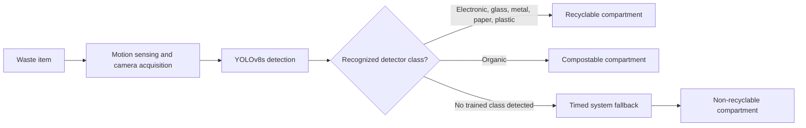

# Deep Learning Based Smart Bin for Efficient Waste Sorting

Research code and reproducibility material associated with the IEEE ICCIT 2024 publication: **Deep Learning Based Smart Bin for Efficient Sorting of Recyclable, Non-Recyclable, and Compostable Materials**.

**Publication:** [IEEE ICCIT 2024 | DOI: 10.1109/ICCIT64611.2024.11022177](https://doi.org/10.1109/ICCIT64611.2024.11022177)

## Overview

This project investigates camera-guided waste segregation using YOLO object detection. A camera captures an incoming item, the detector identifies one of six visual material classes, and the smart-bin concept directs the item to a recyclable or compostable compartment. Items outside the trained classes follow a system-level non-recyclable fallback route.

YOLOv5 and YOLOv8 variants were compared to balance detection quality and latency. YOLOv8s was selected for real-time operation because it provides a strong accuracy-speed trade-off for a resource-constrained smart-bin setting.

## System concept



The report describes Raspberry Pi 4 as the proposed embedded controller for camera-based classification and simulated actuator/servo routing. Non-recyclable is a physical-system fallback, not a seventh object-detection class. Complete GPIO and actuator-control source code is not included in the available materials.

## Waste classes

| Detector class | Smart-bin category |
|---|---|
| electronic, glass, metal, paper, plastic | recyclable |
| organic | compostable |
| unrecognized item | non-recyclable fallback |

## Dataset and preprocessing

The study used 2,340 images assembled from a public Roboflow waste dataset and custom-collected images. It contains six classes and 14 null/background images.

| Split | Images | Approx. share |
|---|---:|---:|
| Training | 1,976 | 84% |
| Validation | 182 | 8% |
| Test | 182 | 8% |

Preprocessing included orientation adjustment and contrast stretching; horizontal and vertical flips were used as augmentation. Annotations were prepared and verified with Roboflow. The original dataset and model weights are not included; obtain them only through authorized sources and verify licensing before use or redistribution.

## Model comparison

| Model | Precision | Recall | F1-score | mAP@50 | Inference time |
|---|---:|---:|---:|---:|---:|
| YOLOv5s | 0.873 | 0.814 | 0.847 | 0.910 | 1.9 ms |
| YOLOv5m | 0.886 | 0.873 | 0.879 | 0.926 | 5.8 ms |
| **YOLOv8s (selected)** | **0.889** | **0.866** | **0.877** | **0.927** | **2.1 ms** |
| YOLOv8m | 0.871 | 0.868 | 0.869 | 0.929 | 3.9 ms |
| YOLOv8l | 0.899 | 0.863 | 0.880 | 0.934 | 5.2 ms |

YOLOv8l obtained the highest mAP@50, but YOLOv8s was selected because its 2.1 ms inference time and mAP@50 of 0.927 provide a practical balance for responsive operation.

## Tools and technologies

- **Python**, **Ultralytics YOLO / YOLOv8**, and **YOLOv5** for model-development and comparison.
- **PyTorch** with CUDA-enabled GPU acceleration in the recorded experiment environment.
- **Roboflow** for dataset sourcing and annotation management.
- **OpenCV** for computer-vision image handling and inference workflows.
- **Raspberry Pi 4**, camera module, motion sensor, motors/servos, and actuators in the reported smart-bin design and simulation.

The recorded historical environment includes Python 3.9.18, Ultralytics YOLO 8.1.14, PyTorch 1.12.1+cu116, and an NVIDIA GeForce RTX 3090. These are experiment records, not current-system requirements.

## Reproducibility and limitations

The published IEEE paper is the source of truth for research claims and reported performance. Development notebook outputs are historical experiment records and may not exactly match the final paper run. Exact reconstruction requires the final dataset revision, checkpoint, full configuration, and execution environment.

This repository does not claim to provide the raw dataset, trained weights, prototype photographs, or complete hardware-control implementation. The hardware material describes the reported design and simulation concept only.

## Citation

```bibtex
@inproceedings{ahmed2024smartbin,
  author = {Maaz Ahmed and Md. Faysal Ahamed and Syeda Munjiba Islam and Puja Roy Dipa and Rahul Debnath and Md Nabil Shariar Sarker},
  title = {Deep Learning Based Smart Bin for Efficient Sorting of Recyclable, Non-Recyclable, and Compostable Materials},
  booktitle = {2024 27th International Conference on Computer and Information Technology (ICCIT)},
  year = {2024}, pages = {2500--2505}, publisher = {IEEE},
  doi = {10.1109/ICCIT64611.2024.11022177}
}
```

## Authors

Maaz Ahmed, Md. Faysal Ahamed, Syeda Munjiba Islam, Puja Roy Dipa, Rahul Debnath, and Md Nabil Shariar Sarker.

This repository represents work associated with a collaborative publication and does not assert individual contribution roles beyond the paper's authorship.

## License and usage

Repository-specific licensing should be finalized by the project authors. Third-party tools and datasets retain their respective licenses, and dataset redistribution rights must be checked separately. The IEEE publisher PDF is not included.
